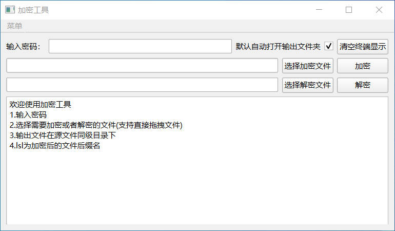

# 介绍
这是一款文件加密软件，可以对单个文件进行加密以及解密。界面如下所示：

# 跨平台
已经发布了windows和macOS（ARM M系列）两个平台的应用，开箱即用。

# 结束
1. 基于Pyside6和pycryptodome构成
2. 十分简易，不支持循环加密（即对加密的文件再次加密，个人认为没有必要，AES256的安全性可以绝对信任）
3. 考虑到方便使用，所以打包成单个exe，app（mac下实际是一个文件夹）
4. 温馨提示：请务必牢记密码，忘了那就真的没办法了。
# 补充说明
加密文件的文件头64个字节有特殊意义，其中前32个字节是随机生成的盐值，后32个字节是验证文件是否加密（即避免重复加密）。密码经过盐化，盐值随机生成。这意味着前32个字节不能被损坏，没有盐值无法进行正常解密。